# LabFlow 工作流系统 - 产品需求文档

## 概述

- **摘要**：使用Python开发一款类似ComfyUI的科研仪器可视化工作流桌面软件，基于PySide6构建本地GUI，支持节点拖拽、连线、拓扑执行、设备控制、流式绘图、工作流保存加载和导出。
- **目的**：为科研人员提供一个直观、高效的工具，用于控制科研仪器、采集数据并进行实时可视化分析。
- **目标用户**：科研人员、实验室技术人员、工程师

## 目标

- 开发一个类似ComfyUI的拖拽式节点工作流系统
- 实现科研仪器控制、数据采集与实时可视化
- 支持跨平台运行（Windows、Linux、树莓派4B）
- 提供流畅的用户体验，支持100+节点的工作流
- 实现工作流的保存、加载和导出功能


## 背景与上下文

- 参考原型： ComfyUI、LabVIEW
- 技术栈选型：Python 3.10+、PySide6、QGraphicsScene/View、pyqtgraph、networkx、numpy、pyserial、asyncio

| 模块       | 技术选型                                 | 版本  |            用途            |
| ---------- | ---------------------------------------- | ----- | :------------------------: |
| GUI 框架   | PySide6                                  | 6.6.2 | 主窗口、节点画布、控件渲染 |
| 画布引擎   | QGraphicsScene/QGraphicsView             | -     |  节点拖拽、连线、布局管理  |
| 绘图引擎   | pyqtgraph                                | 0.13.3 |    流式可视化、实时绘图    |
| 图计算     | networkx                                 | 3.2.1 |   DAG 拓扑排序、执行调度   |
| 数据处理   | numpy                                    | 1.26.4 |   全向量化数据传输与处理   |
|            | pandas                                   | 2.2.1 |        数据处理            |
| 硬件通信   | pyserial                                 | 3.5 |          串口通信          |
| 异步调度   | asyncio                                  | 3.4.3 |     设备并发、流式采集     |
| 数据持久化 | JSON                                     | -     |      工作流、配置保存      |
|            | YAML                                     | 6.0.1 |        配置管理            |
| 日志系统   | logging                                  | -     |     系统日志、设备日志     |
| 命令行工具 | click                                    | 8.1.7 |        命令行工具          |
| 开发工具   | mypy                                     | 1.8.0 |        类型提示            |
|            | black                                    | 23.12.1 |       代码格式化           |
|            | flake8                                   | 6.1.0 |        代码检查            |
| 测试工具   | pytest                                   | 7.4.4 |        单元测试            |
|            | pytest-asyncio                           | 0.21.1 |     异步测试支持           |


- 整体架构分层：UI层、核心逻辑层、设备层、节点层、工作流层

```txt	
依赖清单（requirements.txt）
PySide6==6.6.2
numpy==1.26.4
pandas==2.2.1
pyqtgraph==0.13.3
matplotlib==3.8.4
networkx==3.2.1
pyserial==3.5
asyncio==3.4.3
pyyaml==6.0.1
click==8.1.7
mypy==1.8.0
black==23.12.1
flake8==6.1.0
pytest==7.4.4
pytest-asyncio==0.21.1
```


## 功能需求

- **FR-1**：节点画布支持拖拽、连线、缩放、框选、复制粘贴
- **FR-2**：DAG拓扑执行、左→右顺序、并行子图、节点就绪校验
- **FR-3**：6大类节点：输入输出、设备配置、数据读取、数据处理、可视化、控制流
- **FR-5**：设备抽象统一接口，支持仿真设备与真实硬件，多实例、互斥锁
- **FR-6**：工作流分页、变量管理、日志、异常捕获、快捷键
- **FR-7**：流式绘图、数据分析面板独立于工作流
- **FR-8**：工作流保存、加载和导出功能

## 非功能需求

- **NFR-1**：100+节点流畅运行， UI帧率≥20fps
- **NFR-2**：连续运行≥144小时稳定性
- **NFR-3**：支持一键部署、虚拟环境、Windows/Linux脚本
- **NFR-4**：跨平台支持（Windows、Linux、树莓派4B）

## 约束

- **技术**：Python 3.10+、PySide6、QGraphicsScene/View、pyqtgraph、networkx、numpy、pyserial、asyncio


- **业务**：无特定业务约束
- **依赖**：外部库依赖通过pip安装

## 验收标准

### AC-1：节点画布功能

- **给定**：用户打开应用程序
- **当**：用户尝试拖拽、连线、缩放、框选、复制粘贴节点
- **然后**：操作应流畅响应，节点位置正确更新，连线正确建立
- **验证**：`human-judgment`

### AC-2：DAG拓扑执行

- **给定**：用户创建包含多个节点的工作流
- **当**：用户执行工作流
- **然后**：系统应按照DAG拓扑顺序执行节点，支持并行子图，正确处理节点就绪状态
- **验证**： `programmatic`

### AC-3：节点类型支持

- **给定**：用户打开节点库
- **当**：用户选择不同类型的节点（设备控制、数据采集、信号处理、流程控制、可视化、自定义节点）
- **然后**：所有6大类节点应正确显示并可添加到画布
- **验证**：`human-judgment`

### AC-4：数据结构与传输

- **给定**：工作流包含数据处理节点
- **当**：执行 工作流 时
- **然后**：系统应使用统一的DataPacket数据结构，通过全向量化numpy传输数据
- **验证**： `programmatic`

### AC-5：设备抽象接口

- **给定**：用户配置设备节点
- **当**：用户选择仿真设备或真实硬件
- **然后**：系统应正确处理设备连接，支持多实例和互斥锁
- **验证**： `programmatic`

### AC-6：工作流管理

- **给定**：用户创建复杂工作流
- **当**：用户使用分页、变量管理、日志、异常捕获、快捷键功能
- **然后**：所有功能应正常工作，提升工作流管理效率
- **验证**：`human-judgment`

### AC-7：流式绘图与分析

- **给定**：工作流包含数据采集节点
- **当**：执行 工作流 时
- **然后**：系统应实时显示流式绘图，数据分析面板应正确独立显示
- **验证**：`human-judgment`

### AC-8：工作流持久化

- **给定**：用户创建并编辑工作流
- **当**：用户保存、加载和导出工作流
- **然后**：工作流应正确保存，加载后保持原始状态，导出格式正确
- **验证**： `programmatic`

### AC-9：性能要求

- **给定**：包含100+节点的工作流
- **当**：执行和编辑工作流时
- **然后**：UI帧率应≥20fps，系统应稳定运行≥144小时
- **验证**： `programmatic`

### AC-10：跨平台支持

- **给定**：在Windows、Linux、树莓派4B平台
- **当**：安装并运行应用程序
- **然后**：应用程序应在所有平台正常运行，功能一致
- **验证**：`human-judgment`


| 阶段 | 主要框架                                  | 验证标准                            |
| ---- | ----------------------------------------- | ----------------------------------- |
| 1    | 项目目录结构 + 主窗口 UI 骨架             | 运行 main.py 能看到完整的界面布局   |
| 2    | 节点基类 + 画布交互（拖拽、连线）         | 能从左侧拖节点到画布，节点间能连线  |
| 3    | DAG 执行器 + 基础节点（输入、输出、打印） | 能运行简单的工作流，节点按顺序执行  |
| 4    | 设备基类 + 仿真设备 + 设备节点            | 能添加设备节点，调用仿真设备的方法  |
| 5    | 流式数据 + 实时可视化节点                 | 能看到实时更新的折线图 / 热图       |
| 6    | 工作流保存 / 加载 + 数据分析面板          | 能保存工作流为 JSON，导入后正常运行 |


## 项目目录结构

```
experiment_flow_ui/
├── config/                # 配置文件
│   ├── config_loader.py   # 配置加载器
│   ├── device_config.ini  # 设备配置
│   └── system_config.ini  # 系统配置
├── core/                  # 核心逻辑
│   ├── base_device.py     # 基础设备类
│   ├── base_node.py       # 基础节点类
│   ├── base_workflow.py   # 基础工作流类
│   ├── data_router.py     # 数据路由器
│   ├── exception_handler.py # 异常处理器
│   ├── execution_context.py # 执行上下文
│   ├── graph_executor.py  # 图执行器
│   ├── registry.py        # 注册表
│   └── variables.py       # 变量管理
├── devices/               # 设备抽象和驱动
│   ├── compatibility/     # 兼容性设备
│   ├── laser/             # 激光设备
│   ├── lockin_amplifier/  # 锁相放大器
│   ├── microwave/         # 微波设备
│   └── motor/             # 电机设备
├── nodes/                 # 节点库
│   ├── composite_workflow.py # 复合工作流节点
│   ├── configure_device.py # 设备配置节点
│   ├── control_flow.py    # 控制流节点
│   ├── data_process.py    # 数据处理节点
│   ├── data_read.py       # 数据读取节点
│   ├── debug.py           # 调试节点
│   ├── input_output.py    # 输入输出节点
│   └── visualization.py   # 可视化节点
├── resources/             # 资源文件
│   ├── drivers/           # 设备驱动
│   ├── icons/             # 图标
│   └── themes/            # 主题
├── setup/                 # 安装脚本
│   ├── setup_linux.sh     # Linux安装脚本
│   └── setup_windows.bat  # Windows安装脚本
├── ui/                    # 用户界面
│   ├── analysis_panel.py  # 分析面板
│   ├── canvas.py          # 节点画布
│   ├── device_library.py  # 设备库
│   ├── device_manager.py  # 设备管理器
│   ├── dock_panel.py      # 停靠面板
│   ├── edge_widget.py     # 边控件
│   ├── log_panel.py       # 日志面板
│   ├── log_status_bar.py  # 日志状态栏
│   ├── main.py            # 主入口
│   ├── main_window.py     # 主窗口
│   ├── menu_bar.py        # 菜单栏
│   ├── node_library.py    # 节点库
│   ├── node_widget.py     # 节点控件
│   ├── panel_state_manager.py # 面板状态管理器
│   ├── plot_manager.py    # 绘图管理器
│   ├── plot_panel.py      # 绘图面板
│   ├── plot_widget.py     # 绘图控件
│   ├── property_panel.py  # 属性面板
│   ├── single_workflow_page.py # 单个工作流页面
│   ├── status_bar.py      # 状态栏
│   ├── styled_splitter.py # 样式分割器
│   ├── styles.qss         # 样式表
│   ├── tool_window_manager.py # 工具窗口管理器
│   ├── toolbar.py         # 工具栏
│   ├── variable_manager.py # 变量管理器
│   ├── workflow_library.py # 工作流库
│   └── workflow_tab_panel.py # 工作流标签面板
├── utils/                 # 工具函数
│   ├── config.py          # 配置工具
│   ├── data_structures.py # 数据结构
│   ├── file_io.py         # 文件IO
│   ├── helpers.py         # 辅助函数
│   ├── logger.py          # 日志工具
│   └── persistence.py     # 持久化工具
├── README.md              # 项目说明
├── __init__.py            # 包初始化
├── __main__.py            # 包入口点
├── requirements.txt       # 依赖项
├── run.py                 # 运行脚本
└── setup.py               # 安装配置
```

## 系统架构图

```mermaid
flowchart TD
    subgraph UI层
        MainWindow[主窗口]
        NodeCanvas[节点画布]
        PropertyPanel[属性面板]
        PlotPanel[绘图面板]
        LogPanel[日志面板]
        VariablePanel[变量面板]
        DeviceLibrary[设备库]
        WorkflowLibrary[工作流库]
    end
    
    subgraph 核心逻辑层
        GraphExecutor[DAG执行器]
        DataRouter[数据路由]
        ExceptionHandler[异常处理器]
        Logger[日志管理器]
        Registry[注册表]
        ExecutionContext[执行上下文]
    end
    
    subgraph 节点层
        BaseNode[基础节点]
        InputNode[输入输出节点]
        DeviceNode[设备配置节点]
        ReadNode[数据读取节点]
        ProcessNode[数据处理节点]
        VisualNode[可视化节点]
        ControlNode[控制流节点]
        CompositeNode[复合工作流节点]
    end
    
    subgraph 设备层
        BaseDevice[基础设备]
        SimDevice[仿真设备]
        RealDevice[真实硬件]
        CompatibilityDevice[兼容性设备]
    end
    
    subgraph 配置与工具层
        Config[配置管理]
        DataStructures[数据结构]
        FileIO[文件IO]
        Helpers[辅助函数]
        Persistence[持久化]
    end
    
    %% 调用关系
    UI层 --> 核心逻辑层
    核心逻辑层 --> 节点层
    节点层 --> 设备层
    核心逻辑层 --> 配置与工具层
    节点层 --> 配置与工具层
    设备层 --> 配置与工具层


```



## 开发规范文档

### 1. 编码规范

- 遵循 PEP8 规范
- 缩进：4 空格
- 行宽 ≤ 120
- 文件名：小写 + 下划线，如 `node_widget.py`
- 类名：大驼峰，如 `class BaseNode:`
- 函数/变量：小驼峰或下划线，如 `execute()` 或 `data_packet`
- 常量：全大写，如 `MAX_RETRY_COUNT`

### 2. 注释与 Docstring 规范

- 统一使用 reStructuredText 风格
- 类、公有方法必须写 docstring
- 复杂逻辑块必须加行内注释

### 3. 接口规范

- 所有公共接口必须有明确的参数和返回值类型注解
- 接口变更必须保持向后兼容
- 内部接口应使用下划线前缀标识

### 4. 数据结构规范

- 使用类型提示定义所有数据结构
- 复杂数据结构应使用 dataclasses 或 Pydantic 模型
- 数据传输应使用统一的 DataPacket 结构


## 核心类设计

### 1. BaseNode

```python
class BaseNode:
    """基础节点类"""
    def __init__(self, node_id, name, inputs=None, outputs=None):
        self.node_id = node_id
        self.name = name
        self.inputs = inputs or []
        self.outputs = outputs or []
        self.position = (0, 0)
        self.properties = {}
    
    def execute(self, data_packet):
        """执行节点逻辑"""
        pass
    
    def get_state(self):
        """获取节点状态"""
        pass
    
    def set_state(self, state):
        """设置节点状态"""
        pass
```

### 2. BaseDevice

```python
class BaseDevice:
    """基础设备类"""
    def __init__(self, device_id, name):
        self.device_id = device_id
        self.name = name
        self.connected = False
        self.lock = asyncio.Lock()
    
    async def connect(self):
        """连接设备"""
        pass
    
    async def disconnect(self):
        """断开设备"""
        pass
    
    async def read(self, **kwargs):
        """读取设备数据"""
        pass
    
    async def write(self, data, **kwargs):
        """写入设备数据"""
        pass
```

### 3. Workflow

```python
class Workflow:
    """工作流类"""
    def __init__(self, workflow_id, name):
        self.workflow_id = workflow_id
        self.name = name
        self.nodes = {}
        self.edges = []
        self.variables = {}
        self.pages = []
    
    def add_node(self, node):
        """添加节点"""
        pass
    
    def remove_node(self, node_id):
        """移除节点"""
        pass
    
    def add_edge(self, source_node, source_port, target_node, target_port):
        """添加边"""
        pass
    
    def remove_edge(self, edge):
        """移除边"""
        pass
    
    def get_nodes(self):
        """获取所有节点"""
        pass
    
    def get_edges(self):
        """获取所有边"""
        pass
```

### 4. GraphExecutor

```python
class GraphExecutor:
    """图执行器类"""
    def __init__(self, workflow):
        self.workflow = workflow
        self.graph = nx.DiGraph()
    
    def build_graph(self):
        """构建执行图"""
        pass
    
    def topological_sort(self):
        """拓扑排序"""
        pass
    
    async def execute(self):
        """执行工作流"""
        pass
    
    def check_node_ready(self, node):
        """检查节点是否就绪"""
        pass
```

## 数据结构规范

### 1. DataPacket

```python
class DataPacket:
    """数据包类"""
    def __init__(self, data=None, metadata=None):
        self.data = data or np.array([])
        self.metadata = metadata or {}
    
    def get_data(self):
        """获取数据"""
        return self.data
    
    def get_metadata(self):
        """获取元数据"""
        return self.metadata
    
    def set_data(self, data):
        """设置数据"""
        self.data = data
    
    def set_metadata(self, metadata):
        """设置元数据"""
        self.metadata = metadata
```

### 2. NodeInfo

```python
class NodeInfo:
    """节点信息类"""
    def __init__(self, node_id, node_type, name, position, properties):
        self.node_id = node_id
        self.node_type = node_type
        self.name = name
        self.position = position
        self.properties = properties
```

### 3. DeviceInfo

```python
class DeviceInfo:
    """设备信息类"""
    def __init__(self, device_id, device_type, name, connection_info, properties):
        self.device_id = device_id
        self.device_type = device_type
        self.name = name
        self.connection_info = connection_info
        self.properties = properties
```

## 任务拆解清单

1. **项目初始化与基础架构搭建**
   - 创建项目目录结构
   - 配置依赖项
   - 搭建基础UI框架
2. **核心数据结构实现**
   - 实现 DataPacket 数据结构
   - 实现 NodeInfo 和 DeviceInfo 数据结构
3. **基础节点系统**
   - 实现 BaseNode 类
   - 实现各类节点（输入输出、设备配置、数据读取、数据处理、可视化、控制流）
4. **设备抽象层**
   - 实现 BaseDevice 类
   - 实现仿真设备
   - 实现真实硬件设备接口
5. **工作流系统**
   - 实现 Workflow 类
   - 实现工作流持久化
   - 实现变量管理
6. **图执行器**
   - 实现 GraphExecutor 类
   - 实现 DAG 拓扑执行
   - 实现并行子图执行
7. **UI 实现**
   - 实现主窗口
   - 实现节点画布（拖拽、连线、缩放、框选、复制粘贴）
   - 实现属性面板
   - 实现工具栏
   - 实现绘图面板（流式绘图）
8. **功能集成与测试**
   - 集成所有功能模块
   - 进行性能测试
   - 进行稳定性测试
9. **部署与文档**
   - 编写安装脚本（Windows、Linux）
   - 编写用户指南
   - 编写开发者指南


